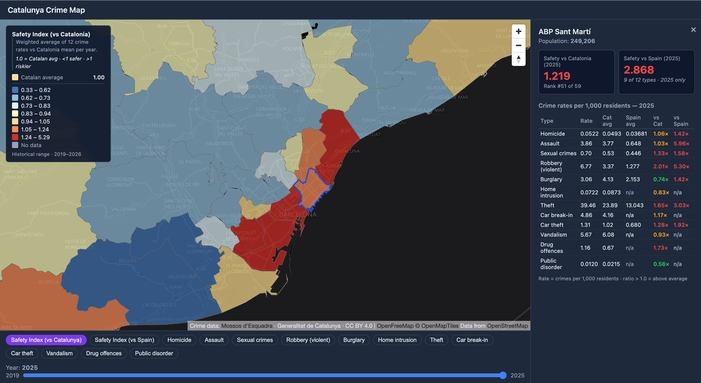

# Catalunya Crime Map — Safety index and neighbourhood comparison

Crime map with weighted safety indices for 59 Àrees Bàsiques Policials (ABP) in Catalunya, 2019–2025. Compare neighbourhood crime rates against Catalan and Spain averages across 12 types.

**Live map → [time2map.github.io/catalunya-crime-map](https://time2map.github.io/catalunya-crime-map/)**



## Data source

Crime statistics from the [Mapa Delinquencial ICGC](https://visors.icgc.cat/mapa-delinquencial/) — the official crime map of the Generalitat de Catalunya published by the Department of Interior (Departament d'Interior), collected by Mossos d'Esquadra.

- **Visualiser:** https://visors.icgc.cat/mapa-delinquencial/
- **Organisation:** Institut Cartogràfic i Geològic de Catalunya (ICGC) + Mossos d'Esquadra
- **Open data licence:** CC BY 4.0 — free for commercial and non-commercial use with attribution

## Repository structure

```
crimes-parser/
├── extract_abp_polygons.py     # download raw CSV + vector tiles → GeoPackage
├── fetch_spain_avg.py          # parse MdI national PDF → spain_averages.json
├── build_safety_gpkg.py        # compute safety indices → web export files
├── data/                       # generated by the pipeline (git-ignored)
│   ├── crimes_catalunya.gpkg
│   ├── safety_catalunya.gpkg
│   ├── spain_averages.json
│   └── Fets_*.csv
└── web/                        # React + MapLibre web app
    ├── src/
    ├── public/data/            # pre-built abp.geojson + stats.json
    └── vite.config.js
```

## Web app

The interactive map is built with React 19 + Vite + MapLibre GL JS 5.

**Features:**
- Choropleth of 59 ABP zones coloured by any of 12 crime types or 2 composite safety indices
- Year slider (2019–2025); global colour scale is fixed across years for fair comparison
- 7-class RdYlBu diverging colour ramp — blue = safer, red = more dangerous
- Click any zone to open a detail panel with per-type rates, Catalunya and Spain averages, and ratio columns
- Safety Index vs Catalunya — weighted average of 12 crime rates relative to the Catalan mean per year
- Safety Index vs Spain — weighted average of 9 crime rates relative to MdI national figures (2025 only)
- EN / ES language switcher; language persisted in URL (`?lang=es`) for shareable links

### Run locally

```bash
cd web
npm install
npm run dev
```

Requires `web/public/data/abp.geojson` and `web/public/data/stats.json` (committed to the repo, or regenerate with `build_safety_gpkg.py`).

## Pipeline

Three scripts regenerate all data from scratch. Run on **Apple Silicon** with arm64 Python:

```bash
# 1. Download raw crime CSVs + ABP polygons
arch -arm64 python3 extract_abp_polygons.py

# 2. Parse national Spain averages from MdI PDF (manual download required — Cloudflare-protected)
#    Download the "Balance de Criminalidad Q4 2025" PDF and place it at data/mdi_2025.pdf
arch -arm64 python3 fetch_spain_avg.py

# 3. Build safety GeoPackage + web export files
arch -arm64 python3 build_safety_gpkg.py
```

### Dependencies

```bash
pip install geopandas shapely pandas pdfplumber
brew install gdal   # macOS — ogr2ogr must be in PATH
```

## Data schema

### ABP polygons

59 police zones (Àrees Bàsiques Policials). Three zones have no polygon:
- **ABP Virtual** — online crimes, no territory
- **ABP Barcelona** — historical aggregate, split into district ABPs since 2024
- **ABP Pla d'Urgell - Garrigues** — absent from 2024 vector boundaries

### `Fets_{year}.csv` — monthly crime statistics

Aggregated by month / ABP / crime type. No individual-level records are published.

| Column | Description |
|--------|-------------|
| `Mes` | Month number (1–12) |
| `Any` | Year |
| `Àrea Bàsica Policial (ABP)` | Police zone name |
| `Tipus de fet` | Crime type (Catalan) |
| `Coneguts` | Registered incidents |
| `Resolts` | Solved |
| `Detencions` | Arrests |

Coverage: January 2019 — present (current year updated with ~1–2 month delay).

### Crime type mapping

The 12 keys used in the web app, mapped from raw CSV values:

| Key | CSV value(s) |
|-----|-------------|
| `homicide` | Homicidi Consumat, Homicidi Temptativa, Assassinat Consumat, Assassinat Temptativa |
| `lesions` | Lesions |
| `sexual` | Agressions sexuals i Abusos sexuals |
| `robbery_violence` | Robatori amb violència i/o intimidació |
| `burglary` | Robatori amb força |
| `home_intrusion` | Entrada a vivenda aliena |
| `theft` | Furt |
| `car_breakin` | Robatori amb força interior vehicle |
| `car_theft` | Robatori i furt d'us de vehicle |
| `vandalism` | Danys |
| `drugs` | Contra la salut pública |
| `disorder` | Desordres públics |

Spain comparison is not available for `home_intrusion`, `disorder`, and `drugs` (not published in MdI national summary).

### Safety index methodology

**Formula:** `Index = Σ(w_i × rate_i / avg_i) / Σw_i`

Where `rate_i` is the zone's rate for crime type `i` (crimes per 1,000 residents), `avg_i` is the reference average (Catalan per-year average, or Spain national average for 2025), and `w_i` is the severity weight.

A score of **1.0** equals the reference average. Below 1.0 = safer than average. Above 1.0 = riskier.

**Weights** are manually assigned based on perceived severity. They are not derived from statistical models, conviction lengths, or victim surveys — this is a deliberate simplification for a public-facing visualisation.

| Crime type | Weight | Rationale |
|-----------|--------|-----------|
| Homicide | 5 | Highest severity, irreversible harm |
| Sexual crimes | 4 | Severe trauma, often underreported |
| Robbery (violent) | 3 | Direct physical threat |
| Assault | 3 | Direct physical harm |
| Burglary | 2 | Property + personal security |
| Home intrusion | 2 | Violation of personal space |
| Car theft | 1.5 | Significant economic impact |
| Drug offences | 1.5 | Public health + order |
| Car break-in | 1 | Baseline |
| Theft | 1 | Baseline |
| Vandalism | 1 | Baseline |
| Public disorder | 1 | Baseline |

**Note on homicide weight:** Homicide rates are very low (0.003–0.05 per 1,000) and highly variable in small zones — a single incident can produce a ratio of 10–40× the average. The ×5 weight amplifies this instability. For small ABP zones, treat homicide-driven index spikes as statistical noise rather than a reliable signal.

**vs Spain index** uses 9 of 12 types — `home_intrusion`, `disorder`, and `drugs` are excluded because MdI national figures do not publish equivalent breakdowns. Spain data is 2025 only.

## Limitations

- **No individual incident coordinates** — data is aggregated per ABP zone
- **Mossos d'Esquadra only** — excludes Guardia Urbana (Barcelona city police)
- **Monthly aggregates** — no exact incident dates
- **From 2019 only** — no earlier data through this source
- **Spain comparison: 2025 only** — MdI national figures are published once a year

## Police regions

| Region | Coverage |
|--------|----------|
| RP Metropolitana Barcelona | Barcelona and inner suburbs |
| RP Metropolitana Nord | Northern Barcelona suburbs |
| RP Metropolitana Sud | Southern Barcelona suburbs |
| RP Girona | Girona province |
| RP Camp de Tarragona | Tarragona province |
| RP Central | Central Catalunya |
| RP Ponent | Western Catalunya (Lleida) |
| RP Alt Pirineu i Aran | Pyrenees and Aran |
| RP Terres de l'Ebre | Ebro Delta |
| Regió Virtual | Online crimes |

---

Data: [Departament d'Interior, Generalitat de Catalunya](https://administraciodigital.gencat.cat/ca/dades/dades-obertes/) · CC BY 4.0
